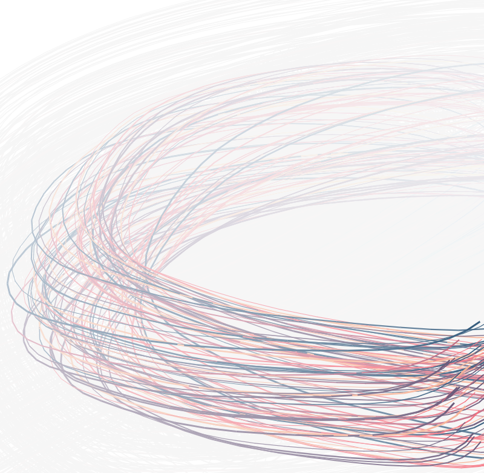

# circularMotion
JS driven animation based on canvas element functionality, following tutorials with circular motion

Note: Keep the project file structure

You can preview this project [here](https://fipie.github.io/circularMotion/)

 

 

